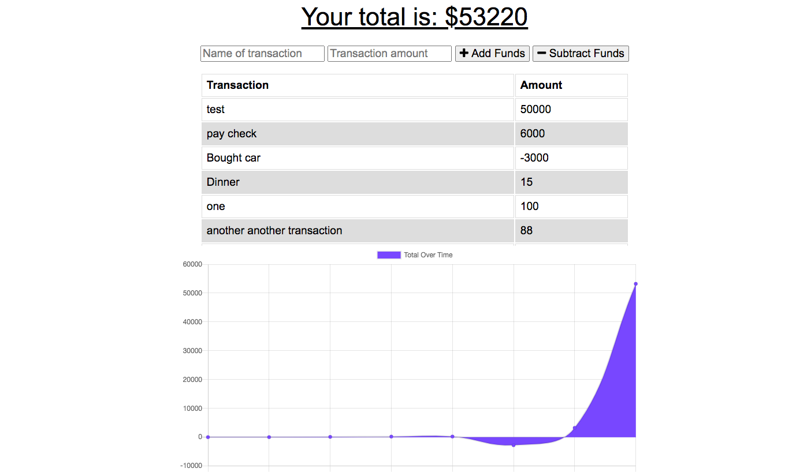
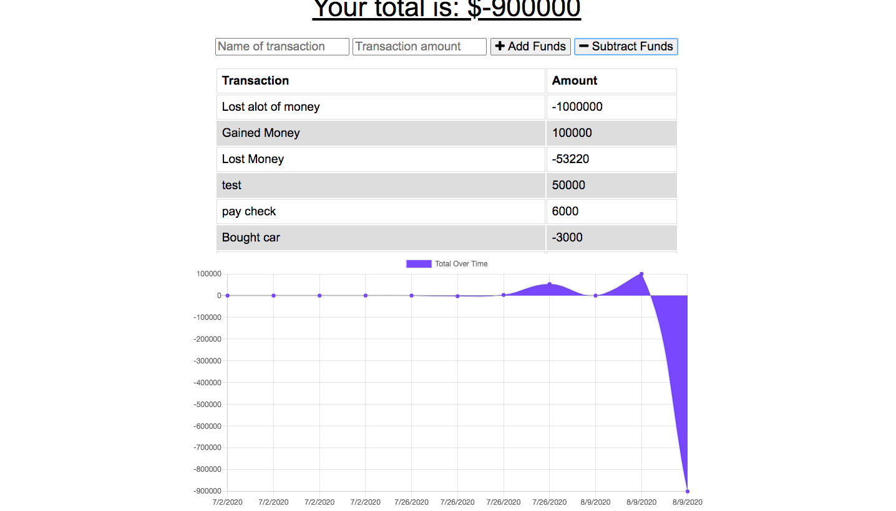
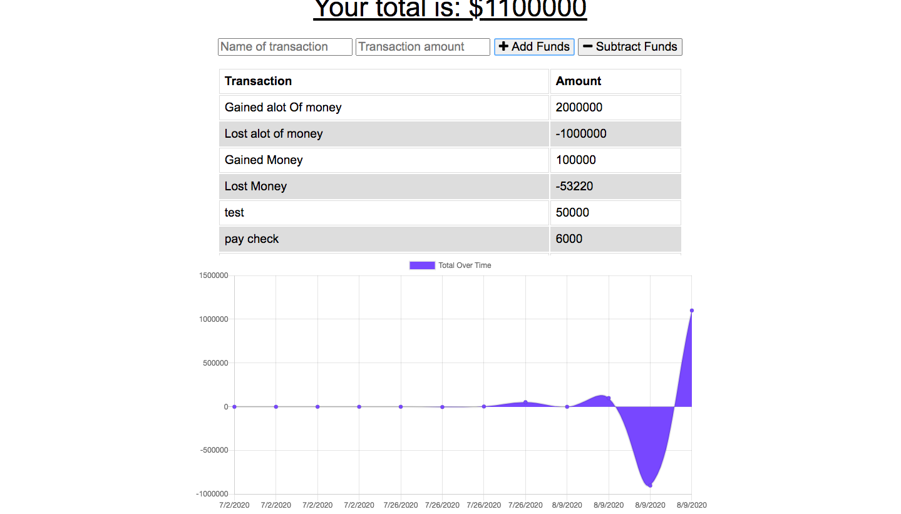

# Online-Offline-Budget-Trackers

## Description

The Online-Offline-Budget Tracker allows the user to use offline access and functionality. The user will be able to add expenses and deposits to their budget with or without a connection. When entering transactions offline, they should populate the total when brought back online. A graph will  display how much the user  funds will be added and subtracted based off  of the combined total and the date  the budgets funds  are calculated.

 ## Click [here](https://online-offline-budget-app.herokuapp.com/) for the live app.  
 
 This is the homepage with previous data:
 
  
 
  
 
 This is what the budget App looks like when  the user loses money:
 
  
 
 This is what the Budget App looks like when the user gains money:
 
 
  
 
## Badges

## Installation

     
     - dotenv
     - lite-sever
     - express 
     - mongoose
     - compression
     - Morgan
     
## Email:

        bml201095@gmail.com
