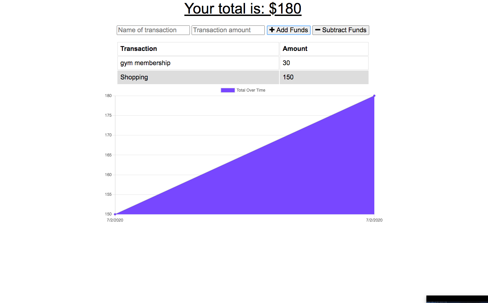

# Online-Offline-Budget-Trackers

  
 
 
# Badges

## Description

The Online-Offline-Budget Tracker allows the user to use offline access and functionality. The user will be able to add expenses and deposits to their budget with or without a connection. When entering transactions offline, they should populate the total when brought back online
## Link to application

https://online-offline-budget-app.herokuapp.com/

## Installation

     
     - dotenv
     - lite-sever
     - express 
     - mongoose
     - compression
     - Morgan
     

## License:

      1.0.0 

### Email:

        bml201095@gmail.com
